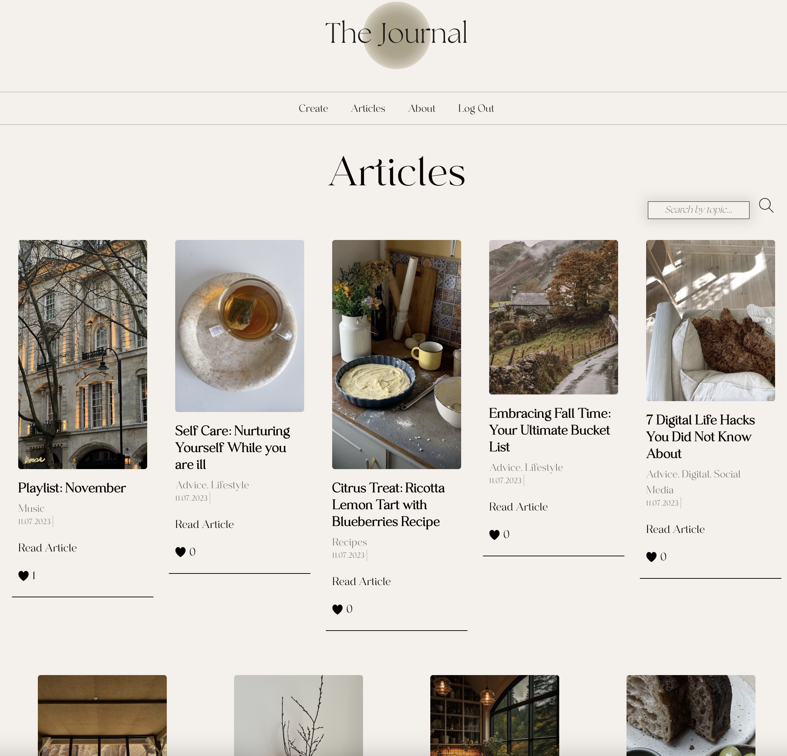
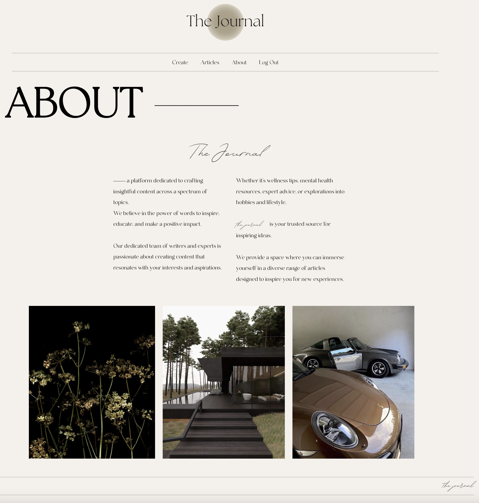
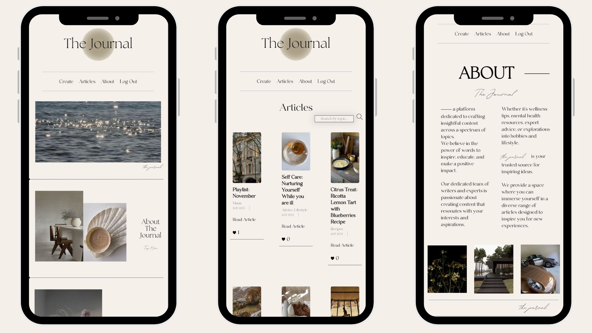

# The Journal 
*The Journal* is a space dedicated to creating meaningful content on a wide range of topics.  

Whether it's wellness tips, mental health resources, practical advice, or explorations into hobbies and lifestyle,  
*The Journal* is your go-to source for uplifting ideas.  

Dive into a variety of articles designed to inspire you for new adventures and experiences.

Home Page

Article Index Page

About Page

Mobile Views

## [Explore a diverse range of insightful articles crafted just for you](https://mariasthejournal.fly.dev/)

- **Home Page**  
  From the home page, users have two main options:
  * About Page: To learn more about the app and its purpose.
  * All Articles: To explore a curated list of articles spanning various topics.

- **All Articles Page**  
  Here, users can browse through a collection of articles, each focusing on a different subject. They can click on an article title to view its details.

- **Article Details Page**  
  On this page, users can delve deeper into a specific topic. They'll find comprehensive information, engaging content, and relevant media related to the chosen article.

- **About Page**  
  Users visiting this page will discover additional insights about the app, its mission, and the team behind it.

## Features
- **Inspiration and Insightful Content:** The app is dedicated to crafting insightful content across a spectrum of topics, designed to inspire, educate, and make a positive impact.

- **Specific Topic Information:** Explore a diverse range of articles, each focusing on a specific topic. 

- **Search Functionality:** Quickly locate articles of interest by utilizing the search functionality. Filter content by topics to find precisely what you're looking for.

- **Pagination:** Effortlessly navigate through a list of articles using pagination controls. Move through pages to discover a wide array of content, from the latest releases to timeless classics.

- **Article Likes:** Engage with content by expressing appreciation through article likes. Show your support for content that resonates with you.

- **Responsive Design:** Enjoy a consistent and user-friendly experience across various devices, including desktops and mobile phones. 

- **Intuitive Navigation:** User-friendly navigation allows seamless movement between pages. Easily transition from the home page to explore articles, dive into specific topics, or learn more about the app's mission.

## Technologies Used
- **Frontend:** HTML5, CSS3, JavaScript
- **Backend:** Python, Django, Neon
- **Database:** PostgreSQL 
- **Deployment:** Fly.io
- **Version Control:** Git and GitHub

## Credits
- **Images:** [Pinterest](https://www.pinterest.com/)
- **Font:** [Dafontfree](https://www.dafontfree.io/the-seasons-font/)

## Ice Box: Future Improvements
- [ ] **Featured Articles or Editor's Picks**
- [ ] **Video Upload**
- [x] **Search Functionality**
- [x] **Article List Pagination**
- [x] **Mobile Optimization**

## Author 

Mariia Zhuravleva | [LinkedIn](https://www.linkedin.com/in/mariia-zhuravleva-5232b3219/)

